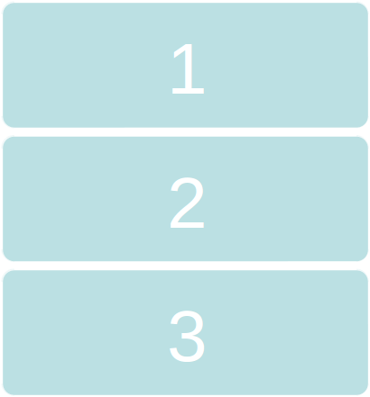
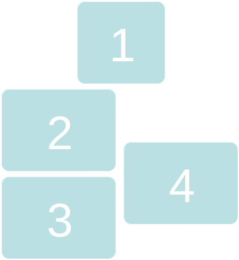
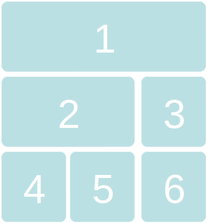

% MAD - Android 2: Context, Resources & Layout
% Patrick Sturm
% 21.09.2016

## Information

* Any issues with this presentation? Write a ticket or send me a pull request ;).
* Repo: [https://github.com/siyb/tw-mad-2-context-resources-layout](https://github.com/siyb/tw-mad-2-context-resources-layout)

# Agenda

## Agenda

* Context
* Providing Resources
* Layouts

# Context

## Context - 1 - Basics

* Context objects provide access to the global context of your application
* Stuff you can access using Context (to name a few)
    * res/ information (for instance: strings defined in string.xml)
    * asset/ files
    * the ContentResolver - vital! - ContentProvider
    * SharedPreferences
    * service binding - vital!
    * application specific external dir
    
## Context - 2 - Basics cont.

* Important classes which extend the abstract Context Class
    * Activity
    * Application - for those who need to keep a global application state
    * Service
* Problems (I have) with Context objects
    * They are the swiss-army-knife of Android (Eierlegendewollmilchsau)
    * They can lead to memory leaks if not handled carefully
    * Due to their swiss-army-knife nature, Context objects are real heavyweights
    
## Context - 3 - Basics cont.

* If you program on Android, there is no way you can circumvent Context objects!
    * If you need a Context in part of your code, try not to save it
    * Never, ever, ever, ever keep static references to a Context
* Next Up: Context memory leak, happens to a lot of beginners, that’s why it’s important to talk about it

## Context - 4 -  Memory Leak

```java
public class MyLeakActivity extends Activity { 
  // static reference to evil 
  private static final Evil e; 

  public MyLeakActivity() { 
    e = new Evil(); 
  } 

  private final class Evil { 
  } 
}
```

## Context - 4 - Memory Leak Explained

* An non static inner class saves an instance of the enclosing class
    * Can be accessed using MyLeakActivity.this and NOT MyLeakActivity _this = this;
* When the Activity is destroyed, the static instance of Evil is retained
    * Evil still holds a reference to MyLeakActivity -> MEMLEAK
* Beware OC!

# Providing Resources

## Providing Resources - 1 - Context & Resources

* The reason we discussed Context implementations, is that we need a Context to access resources.
* We actually did access resources before:
    * setContentView(R.layout.activity_myactivity);
    * findViewById(R.id.myTextView);
* Now, we are going to find out how to provide resources and how we can use them in our Android Applications
* There is a complete lesson dedicated to providing resources, you can find it here: [http://developer.android.com/guide/topics/resources/providing-resources.html](http://developer.android.com/guide/topics/resources/providing-resources.html)

## Providing Resources - 2 - Context Directories

 

## Providing Resources - 3 - Directories Explained

* animator
    * Preferred directory for storing property animations
* anim
    * Tween animations
* color
    * Color state resources (pressed, focused, etc.)
* drawable
    * Shapes, bitmaps (e.g. png, jpeg), 9patches 
* layout
    * Layout files

## Providing Resources - 4 - Directories Explained

* raw
    * Anything else you want to access ;)
* menu
    * Menu “layouts”
* values
    * Simple values: arrays, strings, styles, dimensions
* xml
    * Miscellaneous XML files

## Providing Resources - 5 - Directories Explained cont.

* There are even more directories, most of which provide resources for a certain screen size, resolution, language, orientation or even platform version.
* The Android system will pick the “best” fitting resource on runtime
* If you provide layout-large/mylayout.xml and layout-xlarge/mylayout.xml, layout-xlarge/mylayout.xml would automatically be displayed on tablet devices
* Similarly, if you provide values-en/strings.xml and values/strings.xml, values-en/strings.xml will be used on a device, which is set to English

## Providing Resources - 6 - Algorithm


## Providing Resources - 7 - Algorithm cont.

* MCC – Mobile Country Code
* MNC – Mobile Network Code
* Qualifier: hdpi, ldpi, en, v7, night, etc.

## Providing Resources - 8 - Simple Example

```xml
<?xml version="1.0" encoding="utf-8"?> 
<resources> 
  <string name=“mystring">MyString</string> 
   <string name=“mystring2">MyString2</string> 
</resources> 
```
* This string resource file defines two strings that can be referred to by using mystring and mystring2 respectively
* If we want to access the string within Java code, we need Context
* someContext.getString(R.string.mystring);

# Accessing Resources

## Accessing Resources - 1 - Other Resources

* Sometimes (well it actually happens quite often), you want to refer to a resource from within another resource
* Some examples:
    * Displaying a string in a TextView
    * Aligning View A with View B
    * Setting an image resource for an ImageView or ImageButton
    * Referring to a color inside a XML drawable
* You can do so by using the @ (also @+ if the resource does not exist yet!) symbol or the ? for the currently applied style

## Accessing Resources - 2 - Example

```xml
<?xml version="1.0" encoding="utf-8"?> 
<LinearLayout 
  xmlns:android=
    "http://schemas.android.com/apk/res/android" 
  android:layout_width="match_parent" 
  android:layout_height="match_parent" 
  android:orientation="vertical" > 
  <TextView android:id="@+id/text" 
    android:layout_width="wrap_content" 
    android:layout_height="wrap_content" 
    android:text="@string/sometext" /> 
</LinearLayout>
```

## Accessing Resources - 3 - Accessing Resources From Java Code

* All resources that you create will be available in Java code
* They can be accessed using the R Class, which can be found in the gen/ folder of you Android project
* As the name gen/ suggests, contents in the folder are auto generated, using the “Android Resource Manager”
* Be careful which R Class is imported, sometimes Eclipse will auto import the android.R Class, which does not contain your resources, but Android’s system resources

## Accessing Resources - 4 - The R Class

* Some important inner Classes of R
    * R.layout - this is where layout references are stored
        * R.layout.mylayout
    * R.id - the ids of all views get stored here, the id of a View can be used to access it from Java code
        * R.id.myview
    * R.string - this subclass stores all defined strings. Beware that strings can be defined outside the strings.xml file as well!
        * R.string.helloworld
    * R.drawable - contains references to all drawable resources
        * R.drawable.awesomepicture

## Accessing Resource - 5 - Naming Conventions

* While there are no naming conventions for resources, I personally like to use the following scheme
    * Layout:
        * activity_myactivity.xml or fragment_myfragment.xml
    * View Ids:
        * @+id/activity_myactivity_tv_mytextview or @+id/fragment_myfragment_tv_mytextview
    * Strings:
        * @string/activity_myactivity_mystring
* FS restrictions apply, resources files must be lower case (compatibility with sucky case insensitive fs)
        
# Layouts

## Layouts - 1 - Basics

* Layouts define the UI part of Activities and Fragments
* Pretty straight forward, but can be frustrating at times
* This section provides a simple overview, the best way to get to know layouts is by learning and doing
* There are two important super classes that the Android developer should know about
    * View - something like a TextView, CheckBox, ImageView, basically, a simple widget
    * ViewGroup - ViewGroup is yet another View (it extends the View class), but ViewGroups function as containers for other Views

## Layouts - 2 - Basics cont.

* Every View / ViewGroup can have attributes (XML)
    * android:layout_width and android:layout_height are a necessity for all Views, if not specified, an Exception will be thrown during runtime
    * Different values:
        * match_parent – the View will get as big as allowed by it’s parent
        * wrap_content – the View will size itself to the dimensions required by its content
        * fill_parent – OBSOLETE, replaced by match_parent
        * Any numeric value followed by a unit:  [http://developer.android.com/guide/topics/resources/more-resources.html#Dimension](http://developer.android.com/guide/topics/resources/more-resources.html#Dimension)
        * TRY TO USE DISPLAY INDEPENDENT UNITS!
        
## Layouts - 3 - Basics cont.

* Each View / ViewGroup can have an id, which can be used to access the View from within Java code or another XML resource
* android:id=“@+id/thisismyid”
    * In Java code: someViewGroup.findViewById(R.id.thisismyid);
    * Unfortunately, this method isn’t exactly type safe :/
    * It is customary to cast without checking the type
        * TextView t = (TextView) someViewGroup 	.findViewById(R.id.thisismyid);
    * There are some frameworks that make the whole view finding process a lot more pleasant (e.g. butterknife)
* Note the @+ this means we are creating a resource
* Do NOT add Ids to Views that you don’t want to reference

## Layouts - 4 - LinearLayout



## Layouts - 5 - LinearLayout Explained

* Can be either horizontal or vertical (as seen here)
* Each added child will be added next or below the previous child (depending on orientation)
* The height and width of each child view can also be determined by android:layout_weight

## Layouts - 6 - RelativeLayout



## Layouts - 7 - RelativeLayout Explained

* Used for more complex view hierarchies
* Can replace nested LinearLayouts
* Views are arranged by relations such as
    * right/left of
    * below/above
    
## Layouts - 8 - TableLayout



## Layouts - 9 - TableLayout Explained

* Extends LinearLayout, but promotes a cleaner way to create tables by using rows and columns
* As with LinearLayouts, the width and height can be determined by android:layout_weight
    
## Layouts - 10 - FrameLayout


## Layouts - 11 - FrameLayout Explained

* Designed to hold a single child View
* Can hold more, but it’s hard to use FrameLayout correctly if multiple child views are held, since they tend to overlap (different displays)

## Layouts - 12 - More ViewGroups

* There are many more ViewGroups out there, but today is not the time and place to discuss them
* We will hear of some other special ViewGroups later on, the AdapterViews

## Layouts - 13 - Example

```xml
<?xml version="1.0" encoding="utf-8"?> 
<RelativeLayout 
  xmlns:android=
    "http://schemas.android.com/apk/res/android" 
  android:layout_width="match_parent" 
  android:layout_height="match_parent" 
  android:background="@android:color/black"> 
  <TextView 
    android:id="@+id/tv_widget_temp" 
    android:layout_width="wrap_content" 
    android:layout_height="wrap_content" 
    android:textColor="@android:color/black" 
    android:layout_toRightOf=
      "@+id/activity_myactivity_iv_animage" 
    android:text=
      "@string/activity_myactivity_somestring" 
  />
  ...
</RelativeLayout>
```

## Layouts - 13 - Example cont.

```xml
<RelativeLayout>
  ...
  <ImageView 
    android:id="@+id/activity_myactivity_iv_animage" 
    android:layout_width="wrap_content" 
    android:layout_height="wrap_content" 
    android:src=
      "@drawable/activity_myactivity_specialimage" 
  /> 
</RelativeLayout>
```

## Layouts - 14 - Example Explained

* Simple RelativeLayout that displays an ImageView and a TextView
* The TextView is “right of” the ImageView, but more detail of its position (e.g. vertical positioning) is not given
* By using: android:layout_toRightOf="@+id/activity_myactivity_iv_animage“, we can actually refer to a View before it has been created, note the @+id

## Layouts - 15 - Basic Views

* All widgets below are Subclasses of TextView - can contain pictures
    * Button : A simple button
    * EditText: Input text field
    * CheckBox: A check box (two states)
    * RadioButton: A radiobutto
    * ToggleButton: A toggle button, two states
* ImageView: What could that be?
    * ImageButton - A button containing an Image
* ProgressBar - Progress bar
    
# Any Questions?


